# Install or upgrade Transfer CFT on Kubernetes or Red Hat OpenShift

The Helm chart included in this page bootstraps a Transfer CFT deployment on a [Kubernetes](http://kubernetes.io) or [Red Hat OpenShift](https://www.openshift.com) cluster using the [Helm](https://helm.sh) package manager.

## Prerequisites

  - Kubernetes 1.28 and higher or Red Hat OpenShift 4.10 and higher
  - Helm 3 or later
  - A Linux-x86-64 platform key with no specified hostname

## Architecture
#### Single worker node deployment


#### Multi-worker node deployment


### Deployment strategy
Transfer CFT deploys as a StatefulSet to maintain persistent storage required for the runtime data, such as configuration and catalog. Transfer CFT comprises two main services: the file transfer engine (also named the worker node) and the Copilot, which serves API requests. Both components run in a single container in the same Pod.

When deployed in an orchestrated container environment, Transfer CFT can run in a single-worker node or a multi-worker-node mode (active/active).
- A single worker node deployment (cft.multinode.nodesNumber=1) runs only one Pod (replicas equal 1).
- A multi-worker node deployment (cft.multinode.nodesNumber greater than or equal to 1) runs as many Pods as replicas. The number of replicas must be equal to or higher than cft.multinode.nodesNumber.

### Update strategy
The RollingUpdate strategy applies to Transfer CFT. When updating the Transfer CFT image, the helm upgrade command triggers a pre-upgrade Job responsible for stopping the transfer engine on all pods and exporting the databases. That operation is mandatory while changing the Transfer CFT image version. It requires to specify the following cft.apiLogin/cft.apiPassword or cft.apiToken parameters.

### Scaling strategy
Transfer CFT does not support auto or manual scaling. Before initialization, you must evaluate the number of worker nodes (shards) your Transfer CFT instance requires. The cft.multinode.nodesNumber parameter defines the number of worker nodes. When deploying, adjust the number of replicas to the number of worker nodes.

### Storage and persistent data
Transfer CFT requires persistent storage to store its runtime data, such as the configuration and catalog transfers.
- For a single worker node, Transfer CFT requires a persistent volume with ReadWriteOnce access mode. This volume could be local or a shared file system such as NFS.
- For a multi-worker node, Transfer CFT requires a persistent volume with ReadWriteMany access mode, such as NFS v4. The following requirement applies to Active/active shared file systems for Unix. See persistence* configuration parameters for more details.

Transferred files can reside on the same persistent storage (not recommended), another persistent storage, or an object store such as S3, Google Cloud Storage, or Azure Blob Storage.

### ConfigMaps and secrets
Transfer CFT Helm chart uses secrets to store sensitive data such as certificates, passwords, or API keys. ConfigMap is used only to mount the custom initialization (see cft.initScript.*) and startup (see cft.startScript.*) scripts.

### Networking
External traffic can reach the Transfer CFT service through a LoadBalancer. If you don't need to expose the Transfer CFT's service to external traffic, you can define the Service Type to Cluster IP. See service.* configuration parameters.

The Transfer CFT service exposes multiple ports: 1768 for REST API and 1761, 1762, and/or 1763 for file transfer protocols. You can adjust the exposed ports according to your needs.

### Logging and monitoring
#### Logging
Transfer CFT writes log and traces to stdout.

#### Health checks
Transfer CFT exposes a /healthz endpoint for liveness and readiness.

```yaml
livenessProbe:
  httpGet:
    path: /healthz
    port: restapi
    scheme: HTTPS
  periodSeconds: 10
  successThreshold: 1
  failureThreshold: 3
readinessProbe:
  httpGet:
    path: /healthz
    port: restapi
    scheme: HTTPS
  periodSeconds: 10
  successThreshold: 1
  failureThreshold: 3
```
#### Monitoring
Transfer CFT exposes the /metrics endpoint to collect metrics in OpenMetrics format.

## Configuring the chart
If you want to use local files for the certificates or license files, you can put all in the path transfer-cft/conf or use a custom path (for example, ../../config/certs/myfile.p12).

The following table lists the configurable Transfer CFT chart parameters and their default values. These parameters are defined in ./tranfser-cft/values.yaml.

**Parameter** | **Description** | **Default** | **Mandatory Customization**
--- | --- | --- | ---
`replicaCount` | Number of replicas deployed. | `1` |
`image.repository` | Image repository for the Docker image. | `docker.repository.axway.com/transfercft-docker-prod/3.10/cft` | Yes
`image.tag` | Image tag used for the deployment. | `3.10.2206` | Yes
`image.pullPolicy` | Pull Policy Action for the Docker image. | `IfNotPresent` |
`image.imagePullSecrets` | Secret used to pull an image. | `regcred` |
`nameOverride` | A new name to use for the deployment. | `nil` |
`fullnameOverride` | Name used for the release. | `nil` |
`podLabels` | Additional labels. | `nil` |
`resources` | CPU/memory resource requests/limits. | `{"requests": {"cpu":"100m", "memory":"280Mi"}}` |
`livenessProbe.periodSeconds` | The frequency probe checks container health.| 10 |
`livenessProbe.successThreshold` | Minimum consecutive successes for the probe to be considered successful after having failed. | 1 |
`livenessProbe.failureThreshold` | Minimum consecutive failures for the probe to be considered failed after having succeeded. | 3 |
`readinessProbe.periodSeconds` | The frequency probe checks if the container is ready for traffic. | 10 |
`readinessProbe.successThreshold` | Minimum consecutive successes for the probe to be considered successful after having failed. | 1 |
`readinessProbe.failureThreshold` | Minimum consecutive failures for the probe to be considered failed after having succeeded. | 3 |
`serviceAccount.create` | Create a custom service account for the deployment. | `false` |
`serviceAccount.name` | The Service Account name used for the deployment. | `nil` |
`rbac.create` | Create custom role-based access control (RBAC) for the deployment. | `false` |
`pspEnable.create` | Create a custom pod security policy for the user account. | `false` |
`podAnnotations` | Annotations for pods such as Prometheus scraping. | `{}` |
`podSecurityContext` | The user used no root inside the container. | `{}` |
`containerSecurityContext` | Restriction inside the pod. | `{}` |
`priorityClassName` | Name of the priority class to be used. | `nil` |
`nodeSelector` | The label to deploy on a specific node. | `{}` |
`tolerations` | Toleration is applied to pods and allows (but does not require) the pods to schedule onto nodes with matching taints. | `[]` |
`affinity` | Affinity rules between each pod. | `{}` |
`cft.accept_general_conditions` | Set the parameter to yes if you accept the applicable General Terms and Conditions, located at https://www.axway.com/en/legal/contract-documents | `no` | Yes
`cft.fqdn` | A fully qualified domain name (FQDN) or an IP address used to connect to your Transfer CFT deployment. | `nil` |
`cft.instanceId` | Name of the Transfer CFT instance. | `docker0_cft` |
`cft.instanceGroup` | The Transfer CFT instance group. | `dev.docker` |
`cft.catalogSize` | Number of records in the catalog. | `1000` |
`cft.comSize` | Number of records for the communication file. | `1000` |
`cft.licenseKey.secretName` | Name of the secret used to store the license key. | `license-key`  | Yes
`cft.licenseKey.createSecretFile` | Create the license key using a local file. | `false` |
`cft.licenseKey.localFile` | Relative path to the license key file. You can use the conf directory in the Helm chart. | `{}`<br>(for example, `conf/cft.key`) |
`cft.licenseKey.existingSecretFile.keyRef` | Name of the reference key in an existing secret. | `{}` |
`cft.multinode.nodesNumber` | Number of worker nodes to use. If this number exceeds replicaCount, only replicaCount worker nodes are started. | `1` |
`cft.jvm` | Amount of memory dedicated to the Secure Relay JVM. | `1024` |
`cft.cg.enabled:` | Connectivity with Flow Manager or Central Governance. | `false` |
`cft.cg.host` | Host address of the Central Governance server. | `fm` |
`cft.cg.port` | The listening port for the Central Governance server. | `8081` |
`cft.cg.policy` | The Central Governance configuration policy to be applied during the Transfer CFT registration. | `nil` |
`cft.cg.periodicity` | Central Governance interval between notifications. | `nil` |
`cft.cg.caCert.secretName` | Name of the secret used to store the Central Governance root Certificate Authority. | `cg-ca-cert` |
`cft.cg.caCert.createSecretFile` | Create the Central Governance root Certificate Authority secret at installation using a local file. | `false` |
`cft.cg.caCert.localFile` | The relative path to the Central Governance root Certificate Authority. You can use the conf directory in the Helm chart. | `{}`<br>(for example, `conf/cg_ca.pem`) |
`cft.cg.caCert.existingSecretFile.keyRef` | Name of the reference key inside an existing secret. | `{}` |
`cft.cg.sharedSecret.secretName` | Name of the secret used to store the Central Governance shared secret. | `cg-shared-secret` |
`cft.cg.sharedSecret.createSecretFile` | Create the Central Governance shared secret at installation using a local file. | `false` |
`cft.cg.sharedSecret.localFile` | Relative path to the Central Governance shared secret. You can use the conf directory in the Helm chart. | `{}`<br>(for example, `conf/shared_secret`) |
`cft.cg.sharedSecret.existingSecretFile.keyRef` | Name of the reference key inside an existing secret. | `{}` |
`cft.cg.agentName` | The Flow Manager Agent name that Flow Manager SaaS uses to connect to your Transfer CFT instance. | `nil` |
`cft.copilotCert.secretName` | Name of the secret used to store the Copilot certificate. | `copilot-cert` | Yes
`cft.copilotCert.createSecretFile` | Create the Copilot certificate secret at installation using a local file. | `false` |
`cft.copilotCert.localFile` | Relative path to the Copilot certificate. You can use the conf directory in the Helm chart. | `{}`<br>(for example, `conf/copilot.p12`) |
`cft.copilotCert.existingSecretFile.keyRef` | Name of the reference key inside an existing secret. | `{}` |
`cft.copilotCertPassword.secretName` | Name of the secret used to store the Copilot certificate password. | `copilot-cert-password` |
`cft.copilotCertPassword.createSecretFile` | Create the Copilot certificate password secret at installation using a local file. | `false` |
`cft.copilotCertPassword.localFile` | Relative path to the Copilot certificate password. You can use the conf directory in the helm chart. | `{}`<br>(for example, `conf/copilot.p12.pwd`) |
`cft.copilotCertPassword.existingSecretFile.keyRef` | Name of the reference key inside an existing secret. | `{}` |
`cft.copilotKey.secretName` | Name of the secret used to store the Copilot certificate key. | `copilot-Key` |
`cft.copilotKey.createSecretFile` | Create the Copilot certificate key secret at installation using a local file | `false` |
`cft.copilotKey.localFile` | Relative path to the Copilot certificate key. You can use the conf directory in the Helm chart. | `{}`<br>(for example, `conf/copilot.key.p8`) |
`cft.copilotKey.existingSecretFile.keyRef` | Name of the reference key inside an existing secret. | `{}` |
`cft.copilotKeyPassword.secretName` | Name of the secret used to store the Copilot certificate key password. | `copilot-key-password` |
`cft.copilotKeyPassword.createSecretFile` | Create the Copilot certificate key password secret at installation using a local file. | `false` |
`cft.copilotKeyPassword.localFile` | Relative path to the Copilot certificate key password. You can use the conf directory in the helm chart. | `{}`<br>(for example, `conf/copilot.key.p8.pwd`) |
`cft.copilotKeyPassword.existingSecretFile.keyRef` | Name of the reference key inside an existing secret. | `{}` |
`cft.sentinel.enabled` | Connectivity to Sentinel. Do not use if connectivity with Central Governance is activated. | `false` |
`cft.sentinel.host` | Host address of the Sentinel server. | `sentinel` |
`cft.sentinel.port` | The listening port of the Sentinel server. | `1305` |
`cft.sentinel.useSsl` | Enables SSL cryptography when connecting to Sentinel. | `false` |
`cft.sentinel.logFilter` | Sentinel Log Filter: (I)nformation, (W)arning, (E)rror, (F)atal. Authorized characters are I, W, E, and F, each of which you can only use once. | `EF` |
`cft.sentinel.transferFilter` | Sentinel Transfer Filter. Possible values are ALL, SUMMARY, NO, and ERROR. | `ALL` |
`cft.sentinel.caCert.secretName` | Name of the secret used to store the Sentinel root Certificate Authority. | `sentinel-ca-cert` |
`cft.sentinel.caCert.createSecretFile` | Create the Sentinel root Certificate Authority secret at installation using a local file. | `false` |
`cft.sentinel.caCert.localFile` | Relative path to the Sentinel root Certificate Authority. You can use the conf directory in the helm chart. | `{}`<br>(for example, `conf/sentinel_ca_cert.pem`) |
`cft.sentinel.caCert.existingSecretFile.keyRef` | Name of the reference key inside an existing secret. | `{}` |
`cft.xfbadmLogin` | The xfbadm user login to create a container. If `cft.xfbadmLogin` and `cft.xfbadmPassword.secretName` are defined, the corresponding user is added to the xfbadmusr database.<br>The XFBADM database is used when no other identity provider is used. | `admin` |
`cft.xfbadmPassword.secretName` | Name of the secret used to store the xfbadm user password. | `xfbadm-password` |
`cft.xfbadmPassword.createSecretFile` | Create the xfbadm user password secret at installation using a local file. | `false` |
`cft.xfbadmPassword.localFile` | The relative path to the xfbadm user password. You can use the conf directory in the Helm chart. | `{}`<br>(for example, `conf/xfbadm.pwd`) |
`cft.xfbadmPassword.existingSecretFile.keyRef` | Name of the reference key inside an existing secret. | `{}` |
`cft.apiLogin` | REST API user login, which is used to invoke a Transfer CFT REST API during the pre-upgrade step. When using an identity provider, this should be a valid user for the identity provider.<br>You can replace `cft.apiLogin`/`cft.apiPassword` with `cft.apiToken`. | `admin` | Yes (if `cft.apiToken` not set)
`cft.apiPassword.secretName` | Name of the secret used to store the API user password. | `api-password` | Yes (if `cft.apiToken` not set)
`cft.apiPassword.createSecretFile` | Create the API user password secret at installation using a local file. | `false` |
`cft.apiPassword.localFile` | Relative path to the file API user password. You can use the conf directory in the helm chart. | `{}`<br>(for example, `conf/password.pwd`) |
`cft.apiPassword.existingSecretFile.keyRef` | Name of the reference key inside an existing secret. | `{}` |
`cft.apiToken.secretName` | Name of the secret used to store the API token.<br>`cft.apiToken` can be used instead of `cft.apiLogin`/`cft.apiPassword`. | | `api-token` | Yes (if `cft.apiLogin`/`cft.apiPassword` not set)
`cft.apiToken.createSecretFile` | Create the API token secret at installation using a local file. | `false` |
`cft.apiToken.localFile` | Relative path to the file API token. You can use the conf directory in the helm chart. | `{}`<br>(for example, `conf/token.pwd`) |
`cft.apiToken.existingSecretFile.keyRef` | Name of the reference key inside an existing secret. | `{}` |
`cft.initScript.fileName` | Name of a script to be executed at container initialization. | `init-sh` |
`cft.initScript.createConfigMap` | Create a configmap for the initialization script. | `false` |
`cft.initScript.localFile` | Relative path to the initialization script. You can use the conf directory in the helm chart. | `{}`<br>(for example, `conf/init.sh`) |
`cft.initScript.existingConfigMap.keyRef` | Name of the reference key inside an existing configmap. | `{}` |
`cft.startScript.fileName` | Name of a script to be executed at each container start. | `startup-sh` |
`cft.startScript.createConfigMap` | Create a configmap for the start script. | `false` |
`cft.startScript.localFile` | Relative path to the start-up script. You can use the conf directory in the Helm chart. | `{}`<br>(for example, `conf/startup.sh`) |
`cft.startScript.existingConfigMap.keyRef` | Name of the reference key inside an existing configmap. | `{}` |
`cft.passportPersistencyCheckInterval` | Interval in seconds between two checks of Passport access management updates. | `60` |
`persistence.enabled` | Enable config persistence using PVC. | `true` |
`persistence.keep` | Keep persistent volume after a Helm delete. | `false` |
`persistence.cftData.storageClass` | Persistent Volume Claim Storage Class for config volume. | `nil` |
`persistence.cftData.accessMode` | Persistent Volume Claim Access Mode for config volume. Set to `ReadWriteMany` if `replicaCount` is greater than 1. | `ReadWriteOnce` |
`persistence.cftData.size` | Persistent Volume Claim Storage Request for config volume. See the information on resources to select the correct value for your application. | `2Gi` |
`persistence.cftData.existingClaim` | Manually managed PersistentVolumeClaim (PVC). | `nil` |
`persistence.cftData.nfsPath` | The basepath of the mount point to be used. | `nil` |
`persistence.cftData.nfsServer` | The hostname of the NFS server. | `nil` (IP or hostname) |
`persistence.cftData.reclaimPolicy` | Retain, recycle, or delete. Only NFS supports recycling. | `retain` |
`persistence.cftData.mountOptions` | Mount options for NFS. | `nil` |
`extraSecretMounts` | Additional secret mounts to add. | `[]` |
`extraVolumeMounts` | Additional volume mounts are to be added, such as the volume where transfer files are located. | `[]` |
`extraEnv` | Additional environment variables. | `[]` |
`service.type` | Create a dedicated service for deploying the `LoadBalancer`, `ClusterIP`, or `NodePort`. | `LoadBalancer` |
`service.ports` | Ports definitions for Transfer CFT services. | `[{"name": "restapi","port": 1768}, {"name": "pesit","port": 1761}, {"name": "pesitssl","port": 1762}, {"name": "sftp","port": 1763}, {"name": "copilot","port": 1766}, {"name": "copilotcg","port": 1767}]` |
`service.annotations` | Custom annotations for a service. | `{}` |

To customize your installation values:

1. Copy ./transfer-cft/values.yaml to my-values.yaml for example
2. Specify your customized my-values.yaml file when invoking Helm:

```console
$ helm install --name transfer-cft ./transfer-cft -f my-values.yaml
```
Alternatively, these parameters can be passed via Helm's --set option

```console
$ helm install --name transfer-cft ./transfer-cft \
 --set image.repository=docker.repository.axway.com/transfercft-docker-prod/3.10/cft \
 --set image.tag=3.10.2206 --set resources={ "limits":{"cpu":"1000m","memory":"600Mi"},"requests":{"cpu":"200m","memory":"300Mi"}}
```

### Using existing secrets and configMaps
You can use previously created secrets and configmaps. To do so, create the secrets as follows:

```console
$ kubectl create secret generic <secret_name> --from-file=<key_reference>=<path_to_file>
```
or
```console
$ kubectl create secret generic <secret_name> --from-literal=<key_reference>=<secret_value>
```
Then in the values.yaml file, you reference the secret as follows:
```yaml
secretName: <secret_name>
createSecretFile: false
existingSecretFile:
  keyRef: <key_reference>
```

You can create the configMap in the same manner:
```console
$ kubectl create configmap <configmap_name> --from-file=<key_reference>=<path_to_file>
```
or
```console
$ kubectl create configmap <configmap_name> --from-literal=<key_reference>=<secret_value>
```
Resulting in the following configuration in the values.yaml:
```yaml
fileName: <secret_name>
createConfigMap: false
existingConfigMap:
  keyRef: <key_reference>
```

## Installing the chart

To install the chart with the release name `transfer-cft`:

```console
$ helm install --name transfer-cft ./transfer-cft -f my-values.yaml
```

> **Tip**: You can list all releases using the command: helm list

## Upgrading the chart

To upgrade the chart with the release name `transfer-cft`:

```console
$ helm upgrade --install --name transfer-cft ./transfer-cft -f my-values.yaml
```

The parameter `image.tag` in my-values.yaml should reflect the target version.

> **Tip**: When the chart is deployed using Helm, a pre-upgrade job is created (that uses parameters cft.apiLogin/cft.apiPassword.secretName or cft.apiToken.secretName). This job is automatically called when using the helm upgrade command and will do all the needed operations before the new version of Transfer CFT is deployed.

## Uninstalling the chart

To uninstall/delete the `transfer-cft` deployment:

```console
$ helm delete transfer-cft
```

The command removes all the Kubernetes or Red Hat OpenShift components associated with the chart and deletes the release.

## Resources
The resources needed for Transfer CFT to run correctly depend on how Transfer CFT is used and are based on the catalog size, the number of parallel transfers, and the Transfer CFT configuration. For memory use, you should add the value related to the catalog size and the result of the equations about transfers.

### Catalog size
Catalog Size | Disk space (MB) | Memory (Mi)
--- | --- | ---
 1000 | 512 * cft.multinode.nodesNumber | 250
 10000 | 1000 * cft.multinode.nodesNumber | 500
 100000 | 3000 * cft.multinode.nodesNumber | 2500

### Transfers
#### Sender equation
Add the following for each partener:
```console
SCHKW (from protocol) * 1M * CNXOUT (from partner)
```

#### Receiver equation
Add the following for each partener:
```console
RCHKW (from protocol) * RPACING (from protocol) * CNXIN (from partner)
```

#### Transfers per hour
transfers/h | CPU (m)
--- | --- 
 1000 | 100
 10000 | 250
 100000 | 650

### Example
For a catalog with 10000 records, to perform transfers with only one partner having CNXIN = CNXOUT = 8, using the protocol with SCHKW = RCHKW = 2, it would equal 500Mi (for the catalog) + 16Mi (sender 2 * 1 * 8) + 512Mi (receiver 2 * 32Mi * 8) = 1028Mi of memory needed.

## Copyright

Copyright (c) 2025 Axway Software SA and its affiliates.

## License

All files in this repository are licensed by Axway Software SA and its affiliates under the Apache License, Version 2.0, available at http://www.apache.org/licenses/.

